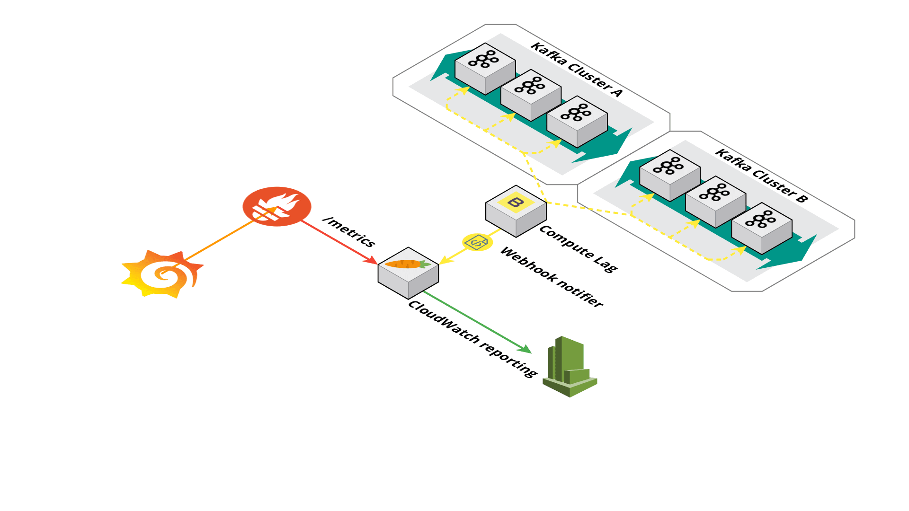

.. Karrot documentation master file, created by
   sphinx-quickstart on Mon Nov  4 05:15:19 2019.
   You can adapt this file completely to your liking, but it should at least
   contain the root `toctree` directive.

Welcome to 🥕 Karrot's documentation!
=====================================

Application diagram
===================

.. toctree::
   :maxdepth: 2
   :caption: Karrot

   burrow/index
   heartbeat/index
   config/index
   reporters/index

Indices and tables
==================

* :ref:`genindex`
* :ref:`modindex`
* :ref:`search`
